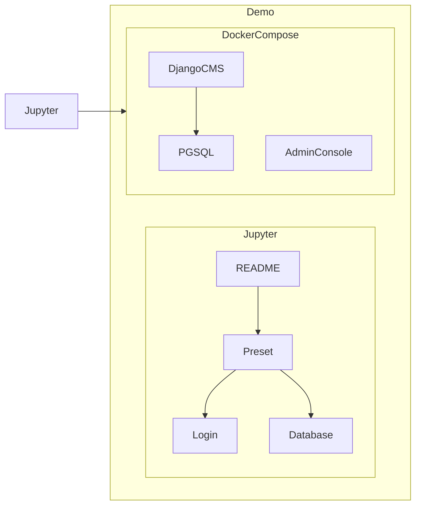

# Jupyter for Devops Demo Project

A demo project to show how to use Jupyter as a runbook for DevOps

## How it works




This project comes with a Django CMS website running inside Docker Compose. It can be manipulated by Jupyter. Jupyter stores a set of "Runbooks," and each runbook serves a different purpose, such as setting up the environment, handling login functionality, and performing database manipulation.

# Prerequisite

```
Python >= 3.8
Docker Compose
conda
```

Reference:

- [Miniconda Installation](https://docs.conda.io/en/latest/miniconda.html)

# Installation

```
VENV=jupyter-devops
conda create --name ${VENV} -y jupyterlab
```

# Startup

```
conda run -n ${VENV} jupyter lab --port 8089
```

Then it will launch the Jupyter Lab in the browser with URL of http://localhost:8089 . Open __README__.ipynb and follow the instruction to explore how to manipulate a Django site with Jupyter.

